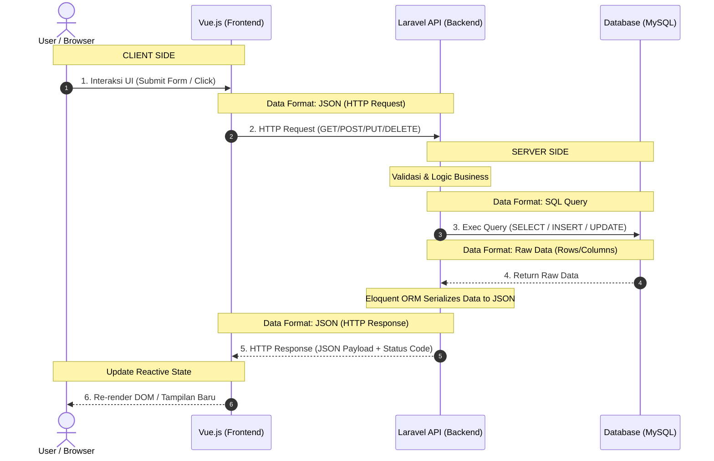

# Proyek Web Praktikum
# Praktikum Pemrograman Web 2

## Deskripsi
Aplikasi sederhana menggunakan Laravel sebagai backend dan Vue sebagai frontend.

## Teknologi
- PHP dan Laravel
- Composer
- Vue dan Vite
- Node.js dan NPM
- MySQL
- Git

## Instalasi Backend
```bash
cd backend
composer install
cp .env.example .env
php artisan key:generate
php artisan migrate
php artisan serve
```

## Instalasi Frontend
```bash
cd frontend
npm install
npm run dev
```

## Arsitektur

